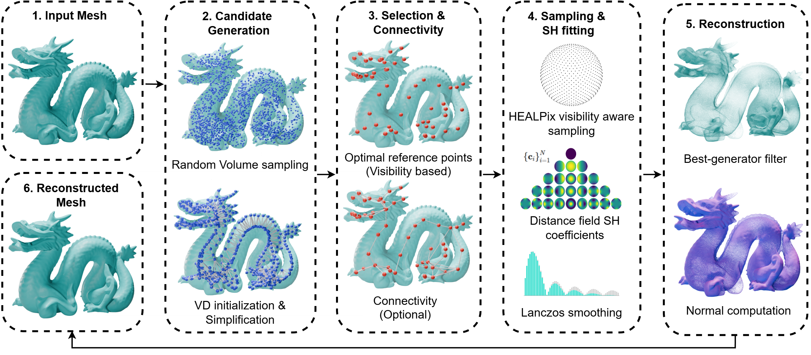

# SHARC: Reference point driven Spherical Harmonic Representation for Complex Shapes

This repository contains the implementation of **SHARC** (Reference point driven Spherical Harmonic Representation for Complex Shapes), a method for efficient 3D shape representation and reconstruction using Spherical Harmonics (SH) centered at optimally selected internal reference points.



## Installation

1. **Create Environment**
   ```bash
   conda create -n sharc python=3.10
   conda activate sharc
   ```

2. **Install Dependencies**
   Install the required packages from `requirements.txt`:
   ```bash
   pip install -r requirements.txt
   ```

## Usage

### 1. Mesh to SHARC representation

Convert a 3D mesh (e.g., `.off`, `.obj`, `.ply`) into the SHARC representation.

```bash
python mesh_to_sharc.py \
    --input_mesh assets/demo/dragon.off \
    --output_dir assets/demo/output/ \
    --lfit 64 \
    --max_reference_points 1000
```

### 2. Reconstruction (SHARC to Mesh)

To reconstruct the mesh from the saved coefficients:

```bash
python sharc_to_mesh.py \
    --model_path assets/demo/output/dragon/coeffs/sh_coeffs.npz \
    --output_dir assets/demo/output/dragon/reconstruction \
    --mesh

```
